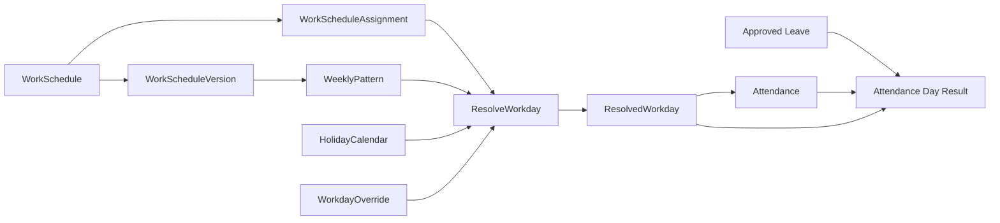

# 勤務体系マスタ設計

**Status:** Phase 2 backend MVP implemented — operational projection generation, anomaly detection, admin calendar API, bulk assignment, and monthly close lock are available. Phase 3 flex/core time/settlement period is implemented end-to-end for the Work Schedule Version API (`crates/domain`, `crates/contract`, `backend` handler/repository/migration); `ResolveWorkday` flex-aware output and settlement balance reconciliation are not yet implemented.

**Updated:** 2026-07-02

**Scope:** 勤務体系の版管理、適用、日別勤務予定の解決、および勤怠との接続

## Implementation Status

2026-06-21時点で、勤務体系マスタ、draft/published版、曜日別勤務区間・予定休憩、
全社・部署・従業員への期間付き割り当て、管理API、および`ResolveWorkday`と
`ResolvedWorkday` projection、および出退勤打刻との接続を実装済み。最初の出勤でprojectionを
固定し、attendanceから不変snapshotを参照する。祝日・予定非勤務日の打刻も保存し、
`is_unscheduled_work`で識別する。
2026-06-22に Phase 1 の残APIを実装し、従業員向け予定取得 (`GET /api/work-schedules/me`)、
マネージャー向け予定取得 (`GET /api/admin/users/{user_id}/resolved-workdays`)、
日別例外のupsert/削除 (`PUT`/`DELETE /api/admin/users/{user_id}/workday-overrides/{date}`) を追加した。
予定取得と日別例外操作は部署スコープ認可に従い、locked済み勤務日の例外変更は `RESOLVED_WORKDAY_LOCKED` で拒否する。
2026-07-02に Phase 2 backend MVP として、未来projection生成、未設定・予定外勤務・打刻漏れanomaly検出、
管理者カレンダーAPI、一括割当、月次締めlockを追加した。frontend管理画面と常駐worker daemonは未実装。
2026-07-02に Phase 3 の最初の増分として、`schedule_type`（Fixed/Flex）・コアタイム・清算期間の
domain model（`crates/domain`）とcontract DTO（`crates/contract`）を追加した。`ScheduleDefinition`の
`flex_policy`により、Fixed/Flexの相互排他、コアタイムの勤務区間内チェック、清算期間の妥当性を検証する。
API・永続化・`ResolveWorkday`への配線、および清算期間残高の実績突合は未実装（[`EP-20260702-work-schedule-phase3-flex-core-time.md`](../exec-plans/active/EP-20260702-work-schedule-phase3-flex-core-time.md)参照）。
2026-07-02にPhase 3のAPI配線として、`CreateWorkScheduleVersionRequest`/`ReplaceWorkScheduleVersionRequest`/`WorkScheduleVersionResponse`へ
`schedule_type`（省略時`fixed`、後方互換）・`flex_policy`を追加し、`work_schedule_versions.schedule_type`カラムと
`work_schedule_settlement_periods`/`work_schedule_core_time_windows`テーブル（migration `048_add_work_schedule_flex_policy.sql`）で永続化した。
handlerは引き続きdomain `ScheduleDefinition::validate()`に不変条件チェックを委譲する。`ResolveWorkday`のflex対応出力・清算期間残高の実績突合は未実装のまま
（[`EP-20260702-work-schedule-phase3-api-wiring.md`](../exec-plans/active/EP-20260702-work-schedule-phase3-api-wiring.md)参照）。

## Decision Summary

勤務体系は、従業員がいつ働く予定かを決める source of truth とする。
単一の可変レコードではなく、次の4層へ分離する。

1. `WorkSchedule` — 論理的な勤務体系マスタ
2. `WorkScheduleVersion` — 適用期間を持つ、公開後は不変の版
3. `WorkScheduleAssignment` — 全社・部署・従業員への期間付き割り当て
4. `ResolvedWorkday` — 特定従業員・勤務日の確定済み勤務予定

この分離により、勤務体系を将来日から変更しても過去の勤怠計算を変えない。
打刻時は `ResolvedWorkday` を参照し、休日や勤務予定外の打刻も破棄せず、事実として保存して異常扱いにする。

## Goals

- 固定勤務、曜日別勤務、夜勤・日跨ぎ勤務を表現できる
- 全社既定、部署、従業員、日別例外の優先順位を一意に解決できる
- 公開後の勤務体系を変更不能にし、履歴再計算の再現性を保証する
- 祝日、休暇、残業申請、打刻、月次締めと疎結合に接続できる
- 現行 backend と rebuild workspace の両方から同じドメイン契約を利用できる

## Non-goals

- 割増賃金額や給与額の計算
- 有給休暇の付与・残高台帳
- 高度なシフト自動作成、必要人員最適化
- フレックス清算期間や変形労働制の全ルール
- 月次締めワークフローそのもの

これらは勤務体系の解決結果を入力として、別のドメインで実装する。

## Terminology

| 用語 | 意味 |
| --- | --- |
| 勤務体系 | 「標準勤務」「夜勤」など、管理者が識別する論理マスタ |
| 勤務体系バージョン | 特定期間に適用される曜日別予定。公開後は不変 |
| 勤務日 | 会社の timezone と日界時刻で識別する業務上の日付 |
| 日界時刻 | 日跨ぎ打刻をどの勤務日に帰属させるか決めるローカル時刻 |
| 割り当て | 勤務体系を全社・部署・従業員へ期間付きで適用する指定 |
| 日別例外 | 特定従業員・日付だけを休日または別勤務体系へ変更する指定 |
| 解決済み勤務日 | 優先順位、祝日、版、例外を適用した日別スナップショット |

## Context And Boundaries



勤務体系は予定を表す。実績である打刻、休暇による不就労、残業承認は勤務体系を上書きしない。
日次・月次の勤怠結果は、予定、実績、承認済み申請を突合して算出する。

## Domain Model

### `WorkSchedule`

論理マスタ。名称変更や廃止は可能だが、勤務ルール自体は保持しない。

| Field | Type | Rule |
| --- | --- | --- |
| `id` | `WorkScheduleId` | typed UUID |
| `code` | string | 1–50文字、全社内で一意、作成後変更不可 |
| `name` | string | 1–100文字 |
| `description` | string? | 最大1000文字 |
| `status` | `active` / `retired` | retired は新規割り当て不可 |
| `created_by` | `UserId` | 監査用 |
| `created_at`, `updated_at` | instant | UTC |

削除は行わない。誤作成で参照がない場合だけ管理用 purge を将来検討する。

### `WorkScheduleVersion`

勤務ルールの不変スナップショット。

| Field | Type | Rule |
| --- | --- | --- |
| `id` | `WorkScheduleVersionId` | typed UUID |
| `work_schedule_id` | `WorkScheduleId` | 親マスタ |
| `version_number` | integer | マスタ内で単調増加 |
| `status` | `draft` / `published` / `cancelled` | published は変更・削除不可 |
| `effective_from` | date | inclusive |
| `effective_until` | date? | exclusive。null は無期限 |
| `timezone` | IANA timezone | MVP既定は `Asia/Tokyo` |
| `workday_boundary` | local time | MVP既定は `05:00` |
| `public_holiday_policy` | enum | `non_working` / `follow_weekly_pattern` |
| `late_grace_minutes` | integer | 0以上。賃金丸めには使わない |
| `early_leave_grace_minutes` | integer | 0以上。賃金丸めには使わない |
| `revision` | integer | draft の楽観的排他制御 |
| `published_by`, `published_at` | optional | published 時に必須 |

同じ勤務体系の published バージョンは、有効期間を重複させない。
バージョンの公開後に誤りが見つかった場合は、新しい版を作成して将来日から切り替える。
過去訂正が必要な場合も元の版は変更せず、訂正理由を監査ログへ残して対象日の再解決を明示的に実行する。

### Weekly Pattern

各バージョンは月曜から日曜まで7件の `WorkScheduleDayRule` を持つ。

| Field | Type | Rule |
| --- | --- | --- |
| `weekday` | 1–7 | ISO weekday、月曜=1 |
| `day_kind` | `working_day` / `non_working_day` | 勤務予定の有無 |
| `expected_work_minutes` | integer | working_day で正数。区間から導出して検証 |

勤務日は1件以上の `PlannedWorkInterval` を持てる構造にする。
Phase 1のpublish検証では1件だけを許可し、split shift対応時に複数件を解禁する。

| Field | Type | Rule |
| --- | --- | --- |
| `sequence` | integer | 日ルール内で一意 |
| `start_time` | local time | timezone は版から継承 |
| `start_day_offset` | 0 | MVPでは0固定 |
| `end_time` | local time | timezone は版から継承 |
| `end_day_offset` | 0 / 1 | 夜勤を1で表現 |

予定休憩は `PlannedBreak` として0件以上保持する。

| Field | Type | Rule |
| --- | --- | --- |
| `sequence` | integer | 日ルール内で一意 |
| `start_time`, `end_time` | local time | 勤務区間内で重複不可 |
| `start_day_offset`, `end_day_offset` | 0 / 1 | 日跨ぎ対応 |

MVPでは予定休憩を表示・不足判定に使い、実績労働時間は実際の休憩打刻から計算する。
予定休憩を自動控除する場合は、別の計算ポリシーとして明示的に追加する。

### `WorkScheduleAssignment`

割り当て先は次のいずれか1つだけとする。

- organization default
- department
- user

| Field | Type | Rule |
| --- | --- | --- |
| `id` | `WorkScheduleAssignmentId` | typed UUID |
| `work_schedule_id` | `WorkScheduleId` | 論理マスタを参照 |
| `target` | `Organization` / `DepartmentId` / `UserId` | exactly one |
| `valid_from` | date | inclusive |
| `valid_until` | date? | exclusive |
| `created_by`, `created_at` | audit fields | 必須 |

版ではなく論理マスタを割り当てる。対象日の published バージョンは resolver が選択する。
同じ割り当て先の有効期間重複は拒否する。

### `WorkdayOverride`

特定の従業員・勤務日だけに適用する例外。

| Field | Type | Rule |
| --- | --- | --- |
| `user_id`, `work_date` | composite identity | 1日1件 |
| `kind` | `non_working_day` / `use_schedule` | 必須 |
| `work_schedule_id` | optional | `use_schedule` の場合必須 |
| `reason` | string | 必須、最大500文字 |
| `created_by`, `created_at`, `updated_at` | audit fields | 必須 |

任意時刻を直接入力する例外はMVPに含めない。夜勤など再利用可能なパターンは勤務体系として登録する。

### `ResolvedWorkday`

resolver の出力を保存した日別 projection。勤怠の再現性を保証する。

| Field | Type | Rule |
| --- | --- | --- |
| `id` | `ResolvedWorkdayId` | typed UUID |
| `user_id`, `work_date` | unique | 従業員・勤務日ごとに1件 |
| `work_schedule_id` | optional | 非勤務日でも provenance を保持可能 |
| `work_schedule_version_id` | optional | 使用した不変版 |
| `source` | enum | override / user / department / organization |
| `source_id` | UUID? | 割り当て・例外の識別子 |
| `day_kind` | enum | scheduled_workday / scheduled_non_working_day / public_holiday |
| `timezone`, `workday_boundary` | snapshot | 版から複製 |
| `expected_work_minutes` | integer | 解決時点の値 |
| `resolved_at` | instant | UTC |
| `locked_at` | instant? | 打刻または締めで固定 |

予定勤務区間と予定休憩も子テーブルへスナップショットする。
`locked_at` 設定後は通常の再生成対象にしない。
同時解決は `(user_id, work_date)` unique制約とtransaction内のupsertで冪等にする。

## Resolution Rules

`ResolveWorkday(user_id, work_date)` は次の順で解決する。

1. 既に locked な `ResolvedWorkday` があればそのまま返す
2. `WorkdayOverride` があれば適用する
3. user assignment を探す
4. 所属部署から親部署へ遡り、最も近い department assignment を探す
5. organization default assignment を探す
6. 対象日の published version を選択する
7. 曜日ルールと `public_holiday_policy` を合成する
8. projection を保存して返す

`non_working_day` overrideもtimezone、日界時刻、不変版のprovenanceを保持するため、
下位優先順位の割り当てから版を選択したうえで勤務区間を空にする。
下位割り当て自体がない場合は`work_schedule_not_configured`とする。

優先順位は次で固定する。

```text
day override > user assignment > nearest department assignment
             > ancestor department assignment > organization default
```

解決できない場合は暗黙の標準勤務を作らず、`work_schedule_not_configured` を返す。
管理画面では未設定者を一覧表示する。

### Department Changes

現行 `users.department_id` は履歴を持たないため、過去日を現在の部署から再解決してはいけない。

- 未来の未ロック projection は部署異動時に再生成する
- 打刻済みまたは締め済み projection は保持する
- 将来、所属履歴を導入した場合は resolver の department source を履歴テーブルへ切り替える

### Holiday Handling

祝日テーブルはカレンダー入力であり、打刻禁止規則ではない。

- `non_working`: 曜日上は勤務日でも祝日は `public_holiday` にする
- `follow_weekly_pattern`: 祝日でも曜日ルールを維持する
- 日別例外は祝日判定より優先する

現行の「休日なら clock-in / clock-out を拒否」は廃止する。
予定外勤務も実績として保存し、`unscheduled_work` anomaly を生成する。

## Time Semantics

- APIの日時は offset 付き RFC 3339、DBの実績時刻は `TIMESTAMPTZ` とする
- 曜日パターンは timezone に依存する local time と day offset で保存する
- 夜勤は `end_day_offset = 1` とし、終了日だけで別勤務日に分割しない
- `work_date` は timezone と日界時刻で決める
- raw punch timestamp は丸めず保存する
- 丸め後時刻や計算結果は派生値として別フィールドへ保存する
- timezone または日界時刻を変更する場合は新しい版を作る

## Persistence Design

PostgreSQL target schema は次のテーブルで構成する。

```text
work_schedules
work_schedule_versions
work_schedule_day_rules
work_schedule_work_intervals
work_schedule_planned_breaks
work_schedule_assignments
workday_overrides
resolved_workdays
resolved_workday_intervals
resolved_workday_breaks
```

主要制約:

- `work_schedules.code` unique
- `(work_schedule_id, version_number)` unique
- published version の期間重複を exclusion constraint で禁止
- assignment は `num_nonnulls(user_id, department_id) + is_org_default = 1`
- 同一targetの assignment 期間重複を exclusion constraint で禁止
- `(version_id, weekday)` unique、7曜日すべて存在
- interval と break は同一日ルール内で重複不可
- `(user_id, work_date)` は override / resolved workday で各々 unique
- published version と locked resolved workday は application とDB triggerの二重で更新禁止

期間はすべて `[from, until)` とする。PostgreSQL では `daterange(from, until, '[)')` を使用する。

## API Contract

既存の `/api` 規約を維持し、resource 名は複数形・kebab-case とする。

### Work Schedule Master

| Method | Path | Auth | Semantics |
| --- | --- | --- | --- |
| `GET` | `/api/admin/work-schedules` | manager+ | 一覧。`status`, `q`, `page`, `per_page` 対応 |
| `POST` | `/api/admin/work-schedules` | system admin | 論理マスタ作成。`201` + `Location` |
| `GET` | `/api/admin/work-schedules/{id}` | manager+ | マスタと版概要 |
| `PATCH` | `/api/admin/work-schedules/{id}` | system admin | name / description の更新 |
| `POST` | `/api/admin/work-schedules/{id}/retire` | system admin | 新規割当を停止 |
| `POST` | `/api/admin/work-schedules/{id}/versions` | system admin | draft版作成。`201` |
| `GET` | `/api/admin/work-schedules/{id}/versions/{version_id}` | manager+ | 版詳細 |
| `PUT` | `/api/admin/work-schedules/{id}/versions/{version_id}` | system admin | draft全体置換、`revision` 必須 |
| `POST` | `/api/admin/work-schedules/{id}/versions/{version_id}/publish` | system admin | 検証して公開 |
| `DELETE` | `/api/admin/work-schedules/{id}/versions/{version_id}` | system admin | draftのみ削除、`204` |

### Assignment And Resolution

| Method | Path | Auth | Semantics |
| --- | --- | --- | --- |
| `GET` | `/api/admin/work-schedule-assignments` | manager+ | target/dateで絞り込み |
| `POST` | `/api/admin/work-schedule-assignments` | system admin | 割り当て作成。`201` |
| `POST` | `/api/admin/work-schedule-assignments/bulk` | system admin | 複数targetへ同一割当を作成、target別結果 |
| `DELETE` | `/api/admin/work-schedule-assignments/{id}` | system admin | 将来割り当て削除、`204` |
| `POST` | `/api/admin/work-schedule-projections/generate` | system admin | 指定ユーザー・範囲のresolved workday生成 |
| `GET` | `/api/admin/work-schedule-anomalies` | manager+ | 未設定・予定外勤務・打刻漏れの検出 |
| `GET` | `/api/admin/users/{user_id}/work-schedule-calendar` | scoped manager+ | resolved workday / attendance / anomalyの日別表示 |
| `POST` | `/api/admin/work-schedule-closures/monthly` | system admin | 対象月のresolved workdayをlock |
| `PUT` | `/api/admin/users/{user_id}/workday-overrides/{date}` | authorized manager | 日別例外をupsert |
| `DELETE` | `/api/admin/users/{user_id}/workday-overrides/{date}` | authorized manager | 未ロック例外を削除、`204` |
| `GET` | `/api/admin/users/{user_id}/resolved-workdays` | scoped manager+ | `from`, `to` 必須 |
| `GET` | `/api/work-schedules/me` | user | 自分の解決済み予定。`from`, `to` 必須 |

`authorized manager` は既存の部署階層スコープを利用する。
マスタ変更と割り当て変更は system admin に限定し、日別例外だけを担当マネージャーへ許可する。

### Representative Payload

```json
{
  "effective_from": "2026-07-01",
  "effective_until": null,
  "timezone": "Asia/Tokyo",
  "workday_boundary": "05:00:00",
  "public_holiday_policy": "non_working",
  "late_grace_minutes": 0,
  "early_leave_grace_minutes": 0,
  "revision": 3,
  "days": [
    {
      "weekday": 1,
      "day_kind": "working_day",
      "work_intervals": [
        {
          "start_time": "09:00:00",
          "start_day_offset": 0,
          "end_time": "18:00:00",
          "end_day_offset": 0
        }
      ],
      "planned_breaks": [
        {
          "start_time": "12:00:00",
          "start_day_offset": 0,
          "end_time": "13:00:00",
          "end_day_offset": 0
        }
      ]
    }
  ]
}
```

### Error Codes

| HTTP | Code | Condition |
| --- | --- | --- |
| `400` | `invalid_work_schedule` | 基本形式不正 |
| `403` | `work_schedule_forbidden` | 権限または部署スコープ外 |
| `404` | `work_schedule_not_found` | resourceなし |
| `409` | `work_schedule_code_conflict` | code重複 |
| `409` | `effective_period_overlap` | 版または割り当ての期間重複 |
| `409` | `published_version_immutable` | published版の変更要求 |
| `409` | `resolved_workday_locked` | 打刻・締め後の変更要求 |
| `409` | `revision_conflict` | draftの楽観ロック失敗 |
| `422` | `invalid_schedule_intervals` | 区間重複、範囲外、休憩不整合 |
| `422` | `work_schedule_not_configured` | 対象日に適用可能な体系なし |

エラー本文は既存の `{ "error", "code", "details"? }` 形式へ合わせる。

## Application Use Cases

`crates/app` に次の明確な入口を置く。

- `CreateWorkSchedule`
- `CreateWorkScheduleDraft`
- `ReplaceWorkScheduleDraft`
- `PublishWorkScheduleVersion`
- `RetireWorkSchedule`
- `AssignWorkSchedule`
- `RemoveWorkScheduleAssignment`
- `SetWorkdayOverride`
- `ResolveWorkday`
- `ListUserWorkdays`
- `RegenerateFutureWorkdays`

`PublishWorkScheduleVersion` は、7曜日の存在、区間、休憩、期間重複を1 transactionで検証する。
`ResolveWorkday` は repository、holiday calendar、organization hierarchy を依存traitとして受け取る。

## Architecture Placement

| Boundary | Responsibility |
| --- | --- |
| `crates/domain` | typed IDs、local interval、weekly pattern、期間、優先順位、不変条件 |
| `crates/app` | 公開、割当、解決、projection再生成のuse case |
| `crates/contract` | request/response DTO、OpenAPI schema |
| `crates/infra-postgres` | version/assignment/projection repository、exclusion constraints |
| `apps/api` | Axum route、認証、DTO変換、HTTP error mapping |
| `apps/web` | マスタ編集、版公開、割当、予定カレンダー |
| `apps/worker` | 未来projectionの事前生成、未設定・異常検出 |

現行 `backend/` へ先行実装する場合も、このuse caseとcontractを呼ぶadapterに留める。
handlerへ解決規則やSQLを追加しない。

## Integration With Existing Features

### Attendance

- `ClockIn` は `HolidayCalendar` 直接判定ではなく `ResolveWorkday` を呼ぶ
- 最初の打刻で `ResolvedWorkday.locked_at` を設定する
- attendance に `resolved_workday_id` を保存する
- 予定外勤務も打刻を保存し、anomalyを付与する
- `ClockOut` と修正承認は同じ resolved snapshot から再計算する

### Holidays

- `holidays` は祝日カレンダーとして継続利用する
- `weekly_holidays` は organization default schedule の曜日ルールへ移行する
- `holiday_exceptions` は `WorkdayOverride` へ移行する

### Leave And Overtime

- 承認済み休暇は予定を削除せず、日次結果に absence reason として重ねる
- 残業申請は予定区間外実績との突合に使う
- 勤務体系変更によって申請レコードを自動変更しない

### Departments

- assignment resolver は既存の可変深さ部署ツリーを使用する
- managerの閲覧・日別例外操作は既存の配下部署認可を再利用する

## Audit And Security

次を監査イベントとして記録する。

- `work_schedule.created`
- `work_schedule.updated`
- `work_schedule.retired`
- `work_schedule_version.created`
- `work_schedule_version.published`
- `work_schedule_assignment.created`
- `work_schedule_assignment.deleted`
- `workday_override.upserted`
- `workday_override.deleted`
- `resolved_workday.regenerated`

監査metadataには actor、対象、旧値・新値、適用期間、理由を含める。
一覧・変更APIには既存の認証、CSRF、rate limitを適用する。

## Migration Strategy

1. domain types と contract DTO を追加する
2. PostgreSQL migrationでマスタ、版、曜日、割当、projectionを追加する
3. 管理者が標準勤務体系をdraft作成し、開始時刻などを確認してpublishする
4. organization default assignmentを作成する
5. 既存 `weekly_holidays` と `holiday_exceptions` を変換する
6. 未来90日を目安に `ResolvedWorkday` を生成する
7. `ClockIn` / `ClockOut` を resolver 接続へ切り替える
8. attendanceへ `resolved_workday_id` を追加する
9. 旧休日拒否ロジックを削除する
10. 移行結果を検証後、旧weekly holiday書き込みAPIを停止する

既存データから標準始業・終業時刻は推測しない。管理者の確認なしに勤務体系をpublishしない。

## Delivery Phases

### Phase 1 — Fixed Schedule MVP

- fixed weekly pattern、夜勤、予定休憩
- version publishと期間制約
- organization / department / user assignment
- holiday合成、日別例外
- employee schedule read API
- clock-in/outとの接続

### Phase 2 — Operational Controls

- 未来projection worker
- 未設定、予定外勤務、打刻漏れのanomaly
- 管理者カレンダーと一括割当
- 月次締めによるprojection lock

### Phase 3 — Advanced Work Arrangements

- flex、core time、清算期間（domain model・Work Schedule Version API配線は実装済み。`ResolveWorkday`のflex対応出力・清算期間残高の実績突合は未実装）
- 変形労働、複数勤務区間
- シフト一括作成・交換
- attendance calculation policyとの接続

## Acceptance Criteria

- 公開済み版を変更しても過去勤務日の予定が変化しない
- 同じ対象・期間に複数割り当てを作成できない
- override、user、department、organizationの優先順位が決定的である
- 日勤と日跨ぎ夜勤を正しいwork dateへ解決できる
- 祝日方針2種と日別例外を正しく合成できる
- 部署異動後もlocked済み勤務日の予定が変化しない
- 予定外勤務でも打刻実績を失わない
- managerが部署スコープ外の予定を閲覧・変更できない
- publish、assignment、overrideが監査ログへ記録される
- API DTO、OpenAPI、frontend clientが同じcontractを使用する

## Required Test Matrix

- domain: interval、日跨ぎ、期間、7曜日、優先順位
- app: publish、overlap、revision conflict、resolve precedence
- repository: exclusion constraint、projection lock、transaction rollback
- API: auth、validation、status code、pagination、CSRF
- integration: holiday、department move、override、clock-in/out
- E2E: マスタ作成→公開→割当→従業員予定表示→打刻

## Follow-up Designs

この設計の後に、次を個別のdesign docとして定義する。

1. 勤怠計算ポリシー（所定内外、深夜、休日、遅刻早退、丸め）
2. 月次締め・承認・再締め
3. 有給休暇付与・残高台帳
4. 給与エクスポート契約
